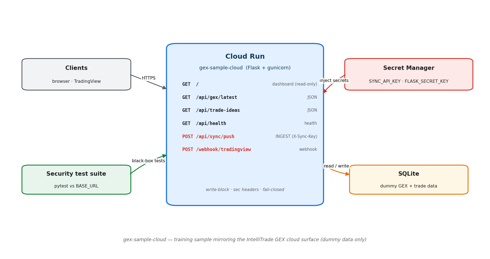

# gex-sample-cloud

A small, self-contained Flask service that **mimics the cloud-facing surface of
the IntelliTrade GEX trading system** — a read-only dashboard backed by SQLite,
an authenticated data-ingestion endpoint, a webhook intake, and a health check.

It exists as a **take-home / training assignment** for the cloud-migration role.
See **[ASSIGNMENT.md](ASSIGNMENT.md)** for the task.

> ⚠️ Everything here is **dummy data**. There are no real accounts, credentials,
> broker integrations, or trading logic. Prices, GEX values, and trades are
> randomly generated. Nothing confidential is included.

## What it represents (and what it deliberately omits)

| Included (representative) | Omitted (not needed to test cloud security) |
|---|---|
| Flask app + read-only dashboard | Real strategy / GEX math |
| SQLite storage + seed data | Broker execution (Tradier/IBKR/Tasty) |
| Authenticated sync ingestion (`/api/sync/push`) | Real account creation / credentials |
| Webhook intake (`/webhook/tradingview`) | The full 18-agent scheduler |
| Health check, write-blocking, security headers | Cloud sync worker internals |
| Secrets via environment (Secret Manager in prod) | — |

## Architecture



```
client / TradingView ──▶  Flask service (this repo)  ──▶  SQLite (dummy data)
                          - GET  /                       dashboard (read-only)
                          - GET  /api/gex/latest         JSON
                          - GET  /api/trade-ideas        JSON
                          - GET  /api/health             health
                          - POST /api/sync/push          INGEST (X-Sync-Key)
                          - POST /webhook/tradingview    webhook intake
   Secret Manager  ──▶    SYNC_API_KEY, FLASK_SECRET_KEY (env)
```

## Run locally

```bash
python -m venv .venv && . .venv/bin/activate      # (Windows: .venv\Scripts\activate)
pip install -r requirements-dev.txt
cp .env.example .env                              # optional; dev defaults work
python run.py                                     # http://127.0.0.1:8080
```

Try it:

```bash
curl http://127.0.0.1:8080/api/health
curl http://127.0.0.1:8080/api/gex/latest
# authenticated ingest (dev key):
curl -X POST http://127.0.0.1:8080/api/sync/push \
  -H "X-Sync-Key: dev-insecure-key-change-me" -H "Content-Type: application/json" \
  -d '{"table":"trade_ideas","rows":[{"ts":"2026-06-30T14:00:00","strategy":"Iron Condor","short_strike":5900,"long_strike":5885,"credit":1.2,"status":"open"}]}'
```

## Tests

```bash
pytest                                            # functional / in-app tests (no network)
```

The **black-box security suite lives in a separate repo** — `gex-sample-cloud-tests`
— and is run by QA against your **deployed URL** (`BASE_URL=… pytest`). You don't
run it from here. The acceptance criteria (exactly what "secure" is checked for)
are documented in **[SECURITY_TESTS.md](SECURITY_TESTS.md)** so there are no
surprises.

## Security posture (already built in)

Parameterized SQL only · API-key auth with constant-time compare · write-blocking
middleware (only `/api/sync/push` + `/webhook/tradingview` are writable) ·
security headers (CSP, HSTS, `nosniff`, `DENY` framing) · fail-closed error
handling (no stack traces) · secrets from env · non-wildcard CORS · loopback-only
dev server. Your job is to **keep this posture intact while deploying to GCP**
and to close the deployment-side gaps (secrets, TLS, least-privilege, etc).
